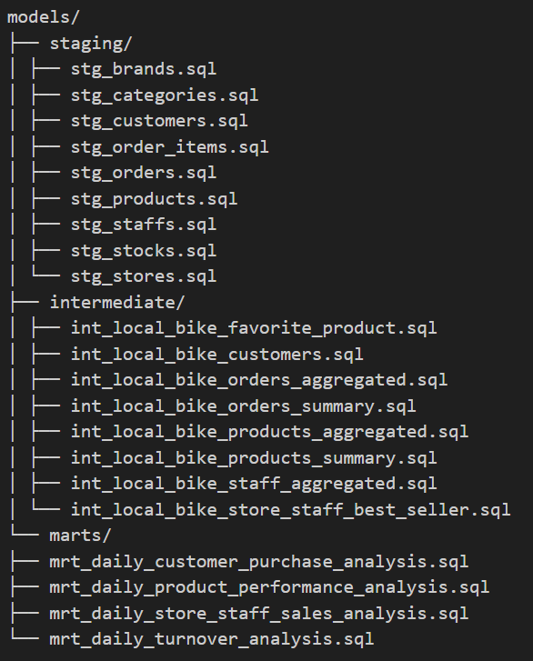

# 📊 dbt Project: Data Transformation for Business Intelligence

## 1. Project Context

This project leverages [dbt (data build tool)](https://www.getdbt.com/) to manage the transformation layer of our modern data stack. The goal is to transform Local Bike company's raw data into clean, reliable, and analytics-ready datasets that support business intelligence, reporting, and decision-making processes.

The project follows the dbt best practices for modular development, version control, testing, and documentation. It is designed to work with a data warehouse (e.g., Snowflake, BigQuery, Redshift) and integrates with upstream data pipelines and downstream BI tools.

## 2. Data Description

The raw data ingested into the warehouse includes the following sources:

- **Brands**: The brand of bikes.
- **Orders**: The orders placed by the customers.
- **Products**: The references available in catalog.
- **Categories**: The category of the bikes.
- **Customers**: Customer registration and profile data from the web platform.
- **Order Items**: Transactional order-level data from the e-commerce backend.
- **Staffs**: The staffs in each store who sale products.
- **Stores**: Store data.
- **Stocks**: The quantity available in hand for each product.

All data sources are stored in the `raw` schema and are periodically refreshed through ingestion pipelines (e.g., via Fivetran or custom ETL jobs).

Note that some data are not complete. This situation limits our ability to perform a comprehensive analysis.

## 3. Data Transformation

The transformation logic is implemented using dbt models organized in the following structure:

- **Staging Models**: Clean and standardize the raw data (naming conventions, data types, basic joins).
- **Intermediate Models**: Build intermediate tables to facilitate data transformation.
- **Mart Models**: Aggregate and summarize data for dashboards and ad-hoc analysis.

Additional features:
- **Tests**: Custom and generic dbt tests validate data quality.
- **Documentation**: dbt's auto-generated documentation site (run `dbt docs generate` and `dbt docs serve`).
- **Sources and Seeds**: Defined in `sources.yml` and `seeds/` for reference data.

## 4. Conclusion

This dbt project provides a scalable and maintainable framework for transforming raw data into meaningful insights. It supports reproducibility, collaboration, and governance in data workflows, ultimately enabling data-driven decision-making across the organization.

For setup instructions and detailed documentation, refer to the [dbt documentation](https://docs.getdbt.com/) or review the individual model files in this repository.

---
*Maintained by the Data Engineering Team • Last updated: May 2025*
